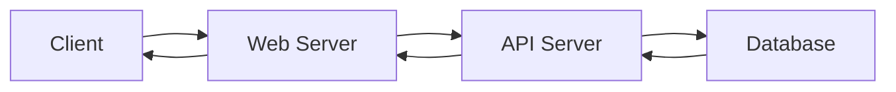

<p align="center">
   
</p>

# 🌐 Python - RESTful API

Welcome to this RESTful API project, where you'll dive into the foundational principles and real-world applications of APIs in modern software development. This project is a key milestone in learning how systems communicate efficiently and securely over the web.

---

## 📖 Introduction

In today’s interconnected software ecosystem, **RESTful APIs** are the backbone of scalable and maintainable web services. Based on the **REST** (Representational State Transfer) architectural style, these APIs provide a stateless, uniform interface for clients to interact with data or services across different systems.

This project focuses on understanding, consuming, creating, and securing REST APIs using tools like `http.server`, `Flask`, and `requests`, while emphasizing best practices in architecture and documentation.

---

## 🎯 Learning Objectives

At the end of this project, you should be able to:

- 🔎 Understand how **HTTP/HTTPS** protocols work and the differences between them.
- 🔧 Use **command-line tools** to interact with RESTful APIs.
- 🐍 Use **Python** to consume and process API responses with the `requests` module.
- 🧱 Build basic APIs using Python’s `http.server`.
- 🚀 Develop modern APIs using **Flask**, managing routes and data.
- 🔐 Implement **authentication and security** mechanisms in your API.
- 📄 Document APIs following **OpenAPI**/Swagger standards to ensure clarity and usability.

---

## 🔗 Why RESTful APIs Matter

REST APIs are used **everywhere** — from mobile apps and SaaS platforms to IoT systems and automation pipelines. Mastering RESTful APIs means gaining the power to build and connect systems seamlessly, enabling communication between platforms, services, and users at scale.

Whether you're syncing user data, building a microservice, or automating workflows, REST is a critical tool in your developer toolkit.

---

## 🔁 Conceptual Diagram



---

### 🧩 Components:

- **Client**: Sends HTTP requests (browser, mobile app, CLI).
- **Web Server**: Routes and pre-processes requests.
- **API Server**: Contains business logic and manages responses.
- **Database**: Stores and serves the requested data.

### 🔄 Flow:

1. Client sends an HTTP(S) request.
2. Web server forwards it to the API server.
3. API server processes it and interacts with the database.
4. API server sends back a response.
5. Web server returns it to the client.

---

## 📁 Project Files and Descriptions

| File Name              | Description                                                                 |
|------------------------|-----------------------------------------------------------------------------|
| `README.md`            | Project overview and documentation                                          |
| `main_02_requests.py`  | Test script to consume an API using Python’s `requests` library             |
| `task_02_requests.py`  | Implements fetching and handling API data using `requests`                  |
| `task_03_http_server.py` | Basic API implementation using Python’s built-in `http.server` module    |
| `task_04_flask.py`     | RESTful API built using Flask with proper routing and JSON handling         |
| `task_05_basic_security.py` | Adds basic security/authentication features (e.g. token or header-based) |

---

## 🧪 Testing & Environment

- Allowed editors: `vi`, `vim`, `emacs`
- Python version: **3.8.x**
- All files should end with a new line.
- Test files should follow consistent naming and structure.
- All scripts must be **executable** and respect **PEP8** coding standards.

---

## 📏 Python Style Guide — PEP8

This project adheres to the **Python Enhancement Proposal 8 (PEP8)** standard, enforced with **pycodestyle**:

```bash
pycodestyle your_script.py
```

---

## 📏 PEP8 Compliance

PEP8 ensures that your Python code is:

- ✅ **Readable**
- ✅ **Consistent**
- ✅ **Easy to maintain**

---

## ✍️ Author

**P-Y74**  
🔗 [GitHub Profile](https://github.com/P-Y74)

---

## 🏫 Holberton School

This project is part of the **Foundations Curriculum** at **Holberton School**, focused on mastering real-world web development practices through RESTful APIs and Python.
